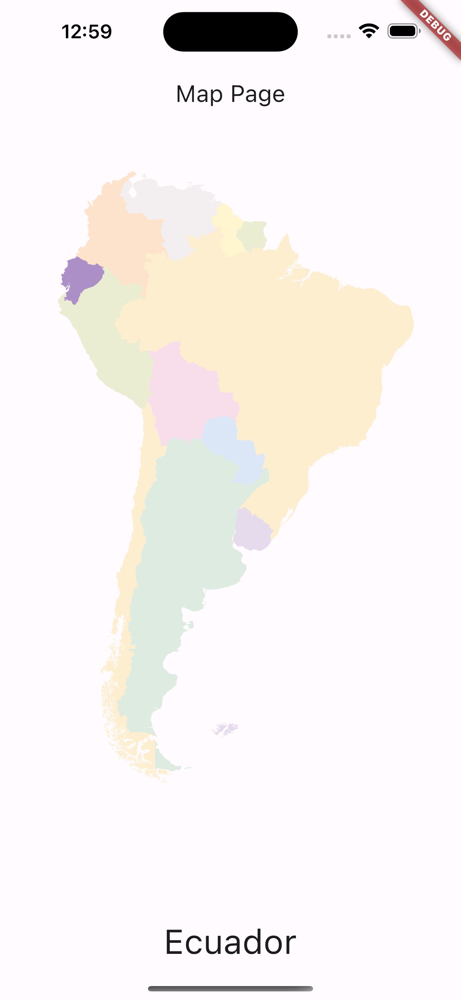

# Flutter Interactive SVG Map



This Flutter application utilizes an interactive SVG map to provide a seamless and engaging user experience. By simply clicking on a specific country on the map, users can access detailed information about that country.

## Features

- Interactive SVG map: Users can click on any country on the map to select it.
- Country information: Once a country is selected, relevant information about the country, such as its name, capital, population, and official language, is displayed.
- User-friendly interface: The application offers an intuitive and visually appealing user interface, making it easy for users to navigate and interact with the map.

## Installation

1. Clone the repository:

```
git clone https://github.com/alvaroarmijos/interactive_svg.git
```
2. Navigate to the project directory:

```
cd interactive_svg
```
3. Run the application:
```
flutter run
```
## Usage

Once the application is running, you can explore the interactive SVG map by clicking on different countries. The corresponding country information will be displayed in real-time.

Feel free to customize the application to suit your specific needs. You can modify the SVG map, add more country data, or enhance the UI according to your requirements.

## Contributing
Contributions are welcome! If you have any ideas, suggestions, or bug fixes, please submit a pull request.

## License
This project is licensed under the MIT License. Feel free to use and modify the code as per the terms of the license.

## Acknowledgments
- The SVG map used in this project is sourced from [Vemaps](https://vemaps.com/)
- Special thanks to the Flutter community for their support and valuable resources.

Enjoy exploring the world with our interactive SVG map! If you have any questions or need assistance, please don't hesitate to reach out.

Happy coding! 🚀✨

# interactive_svg
